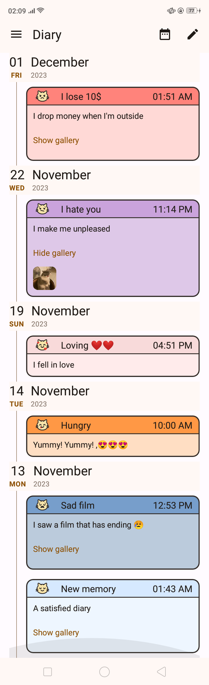
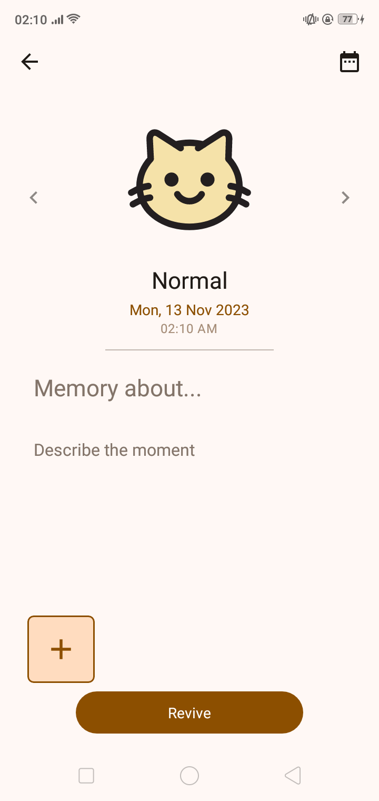
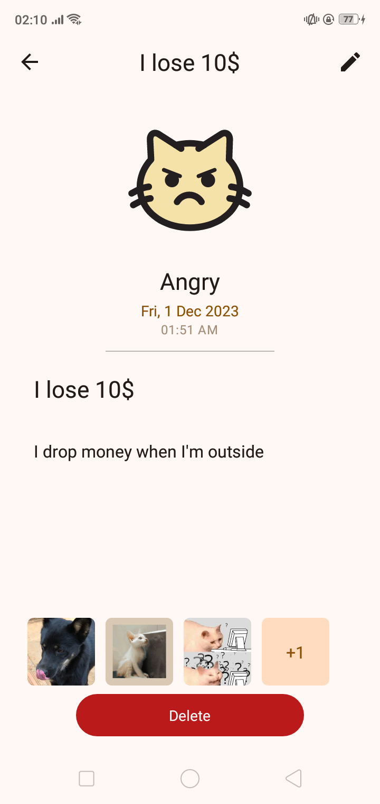
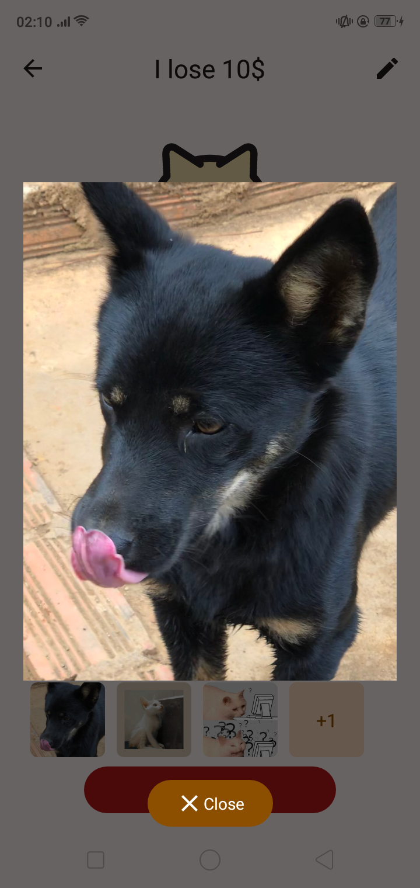
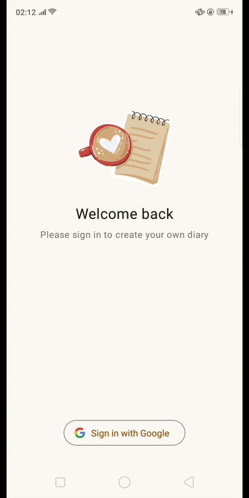
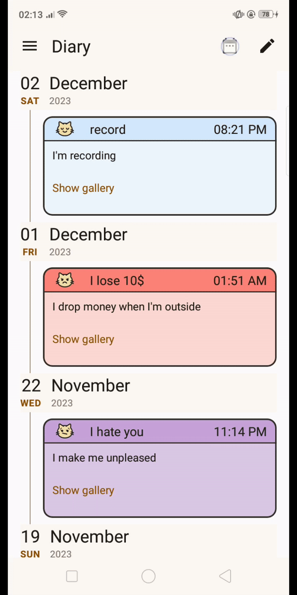

## :building_construction: Tech Stack
- Kotlin
- MongoDB
- Firebase Storage
- GCP (APIs & Services)

## :camera_flash: **Screenshots**
### Home Screen

### Write Screen

### Feature
- Login
- Add diary
- Filter

